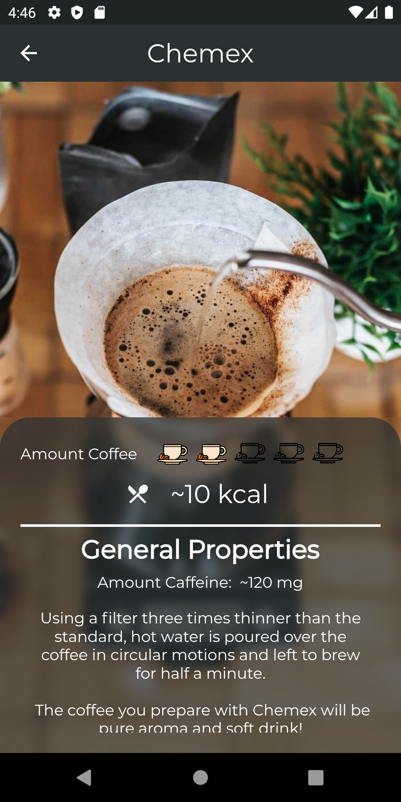

<!--
*** Thanks for checking out the Best-README-Template. If you have a suggestion
*** that would make this better, please fork the repo and create a pull request
*** or simply open an issue with the tag "enhancement".
*** Thanks again! Now go create something AMAZING! :D
-->

<!-- PROJECT SHIELDS -->
<!--
*** I'm using markdown "reference style" links for readability.
*** Reference links are enclosed in brackets [ ] instead of parentheses ( ).
*** See the bottom of this document for the declaration of the reference variables
*** for contributors-url, forks-url, etc. This is an optional, concise syntax you may use.
*** https://www.markdownguide.org/basic-syntax/#reference-style-links
-->

[![Stargazers][stars-shield]][stars-url]
[![LinkedIn][linkedin-shield]][linkedin-url]

<!-- PROJECT LOGO -->
 

  

  <h3 align="center">Kahvenya (Coffenia)</h3>

  

    Coffenia (Kahvenya) The app that makes you love coffee!
     
    <a href="https://play.google.com/store/apps/details?id=com.ekinberkbozkurt.flutter.kahvenya&hl=en"><strong>Google Play Link</strong></a>
     
     
  

<!-- TABLE OF CONTENTS -->

  
Table of Contents

  <ol>
    <li>
      <a href="#about-the-project">About The Project</a>
      <ul>
        <li><a href="#built-with">Built With</a></li>
      </ul>
    </li>
    <li><a href="#contact">Contact</a></li>
    <li><a href="#acknowledgements">Acknowledgements</a></li>
  </ol>

<!-- ABOUT THE PROJECT -->

## About The Project

 

Coffenia (Kahvenya) The app that makes you love coffee!

Features:  
• What do celebrities drink ? 
• Coffee Ingredients 
• Espresso Based Coffees 
• - Espresso 
• - Americano 
• - Latte 
• - Mocha 
• - Macchiato 
• - Cappuccino 
• - Freddo 
• - Irish Coffee  
• Brewed Coffees 
• - V60 
• - Chemex 
• - French Press 
• - Moka Pot 
• - Aeropress 
• - Cold Brew 
• Milkshake 
• Frozen 
• Smoothie 
• Strength Rates 
• Caffeine Rates 
• Milk Rates 
• Milk Foam Rates 
• Note 
• Calories 
• Hot and Cold Drinking of Coffees 
• Coffee Recipes 
• Coffee History  

-Have you entered Starbucks and don't know what to buy? 
-Do you know and wonder about the types of coffee? 
-Are you having trouble naming the coffee varieties? 

You should download the app now! Coffenia will help you make a great cup of coffee. 

• About roasting, brewing and tasting. 
• Learn more about the preparation methods: V60, Aeropress, Chemex, Turkish Coffee, Cold Brew, French Press, Moka Pot. 

Upcoming Features: 
• More Language Support 
• Suggestions of coffee tasters 
• My favorite Coffees 
• Most popular coffees (YEAR-MONTH) 
• The best coffees you can drink at Starbucks! 

### Built With

- [Dart](https://dart.dev/)
- [Flutter](https://flutter.dev/)
- [Easy Localization](https://pub.dev/packages/easy_localization)

<!-- CONTACT -->

## Contact

Ekin Berk Bozkurt - [Linkedin](https://www.linkedin.com/in/ekinberkb/) - ekinberkbozkurt@gmail.com

Project Google Play Link: [https://play.google.com/store/apps/details?id=com.ekinberkbozkurt.flutter.kahvenya&hl=en](https://play.google.com/store/apps/details?id=com.ekinberkbozkurt.flutter.kahvenya&hl=en)

<!-- ACKNOWLEDGEMENTS -->

## Acknowledgements

- [GitHub Emoji Cheat Sheet](https://www.webpagefx.com/tools/emoji-cheat-sheet)
- [Img Shields](https://shields.io)
- [Choose an Open Source License](https://choosealicense.com)
- [GitHub Pages](https://pages.github.com)
- [Animate.css](https://daneden.github.io/animate.css)
- [Loaders.css](https://connoratherton.com/loaders)
- [Slick Carousel](https://kenwheeler.github.io/slick)
- [Smooth Scroll](https://github.com/cferdinandi/smooth-scroll)
- [Sticky Kit](http://leafo.net/sticky-kit)
- [JVectorMap](http://jvectormap.com)
- [Font Awesome](https://fontawesome.com)
- [Readme Template](https://github.com/othneildrew/Best-README-Template)

- This readme file copied from Best-README-Template, if you want to use this original file go to => https://github.com/othneildrew/Best-README-Template

<!-- MARKDOWN LINKS & IMAGES -->
<!-- https://www.markdownguide.org/basic-syntax/#reference-style-links -->

[stars-shield]: https://img.shields.io/github/stars/othneildrew/Best-README-Template.svg?style=for-the-badge
[stars-url]: https://github.com/EBBozkurt/Kahvenya-Github-Preview/stargazers
[linkedin-shield]: https://img.shields.io/badge/-LinkedIn-black.svg?style=for-the-badge&logo=linkedin&colorB=555
[linkedin-url]: https://www.linkedin.com/in/ekinberkb/
[product-screenshot1]: images/1.png
[product-screenshot2]: images/2.png
[product-screenshot3]: images/3.png
[product-screenshot4]: images/4.png
[product-screenshot5]: images/5.png
[product-screenshot6]: images/6.png
[product-screenshot7]: images/7.png
[product-screenshot8]: images/8.png
